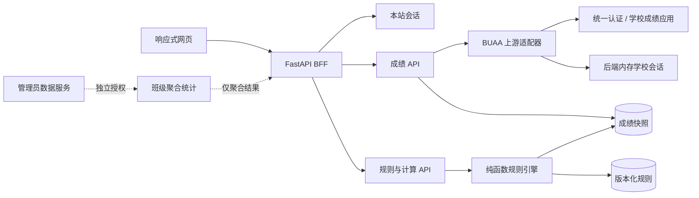

# Student Helper 系统设计

## 1. 产品判断

这个系统的核心不是“再做一个成绩查询页”，而是把三个容易混淆的事实拆开：学校返回了什么、规则允许计入什么、学生为未来做了什么假设。

因此每一个展示值都必须能回答四个问题：数据来自哪里、使用哪个规则版本、哪些课程被计入、是否包含假设。首页主路径只保留“看当前结果 - 找缺口 - 做一次情景测算”，规则编辑和 AI 生成都放到后续版本。

### 当前版本范围

- 多用户数据模型、未登录演示态和浏览器隔离的学校会话。
- 本人成绩的北航 SSO/成绩应用直连适配器。
- 软件学院 2024 级推免默认规则。
- 课程明细、规则进度、结果解释、人工修正和情景测算。
- Windows 单机与 Docker Compose 单实例部署。

### 暂不实现

- 公开规则市场和可视化规则编辑器。
- 班级排名、全班均分和跨学生原始数据查询。
- AI 分析报告、规则文档自动生成和综测计算。

## 2. 已确认规则

规则来源为《软件学院推荐优秀应届本科毕业生免试攻读研究生平均学分绩点成绩规则说明（适用 2024 级）》：

1. 课程学分绩点等于课程绩点乘学分，平均学分绩点等于课程学分绩点和除以总学分。
2. 百分制课程：`4 - 3 × (100 - X)² / 1600`，60–100 分适用；60 分绩点为 1，60 分以下为 0，按正考成绩计入。
3. 五级制：优秀 4、良好 3.5、中等 2.8、及格 1.7、不及格 0。
4. 两级制通过/不通过课程不累计学分绩点。
5. 统计 2027 年春季学期及之前课程。
6. A–F 最低框架：数理基础 6 门、工程基础 4 门、外语 6 学分、思政 6 门、核心专业 14 门、方向课 6 学分，并通过 4 门一般专业必修课。

### 未决项

文件没有定义方向课实际修读超过 6 学分后的选课顺序。系统使用 `manual_confirmation`：学生或学院确认具体组合后才产生确定值；确认前计算所有“达到最低学分且总学分最小”的组合，展示当前区间，但不把区间上限标成官方成绩。

如果学院后续确认“全部计入”“取最高 6 学分”“按修读顺序”或其他政策，只需发布同一规则的新版本，不改历史结果。

## 3. 信息架构与视觉语言

视觉主题为“学业飞行记录”，但只借用航道、状态灯和记录簿三种信息隐喻，不做装饰性仪表盘。

- 颜色：北航深蓝 `#0F2F5A`、航迹蓝 `#1768A6`、信号绿 `#08756C`、琥珀 `#A75509`、纸白 `#FFFFFF`、冷灰底 `#F2F6F9`。
- 字体：中文使用 Microsoft YaHei UI / Noto Sans SC；数值使用 Bahnschrift，以便 GPA、分数和学分在窄列中稳定对齐。
- 对齐：正文和操作左对齐；数值按统一小数位展示。重要状态依赖文字与颜色双重表达。
- 响应式：桌面使用 248px 固定导航；820px 以下切换为顶部状态条和底部三项导航；成绩表允许横向滚动。
- 动效：仅保留操作反馈，不使用自动入场动画；支持 `prefers-reduced-motion`。

主页面结构：

```text
┌────────────┬────────────────────────────────────────────┐
│ 固定导航   │ 标题 / 学院与年级 / 接入状态              │
│            ├────────────────────────────────────────────┤
│ 总览       │ 当前 GPA      计入学分 / 均分 / 截止时间  │
│ 成绩       ├────────────────────────────────────────────┤
│ 规则       │ A ─ B ─ C ─ D ─ E ─ F 规则航道           │
│            ├──────────────────────┬─────────────────────┤
│ 数据状态   │ 未修课程情景测算     │ 数据可信度          │
└────────────┴──────────────────────┴─────────────────────┘
```

这套设计避免把所有信息切成同尺寸 SaaS 卡片：总览是一张连续记录板，A–F 是一条规则航道，课程是密度更高的可筛选表格，规则页则接近版本化文档。

## 4. 架构



### 当前代码分层

- `app/rules.py`：默认规则的稳定、可版本化定义。
- `app/calculation.py`：不访问网络和数据库的纯计算层，方便用固定样例审计。
- `app/database.py`：SQLite 仓储；每条课程保留 `source` 和人工选择状态。
- `app/integrations/buaa.py`：SSO 预登录、验证码、身份验证、学校 Cookie 隔离和成绩抓取。
- `app/main.py`：面向页面的 API/BFF，不把学校 Cookie 暴露给浏览器。
- `app/static/`：无构建步骤的原生 HTML/CSS/JavaScript，降低 Windows 部署复杂度。

### 生产演进

SQLite WAL 适合 Windows 本机和单实例服务器。需要多副本、任务队列或较高并发时，将仓储接口切换到 PostgreSQL；学校会话进入 Redis 或专门的加密会话仓库。规则引擎保持不变。

## 5. 数据模型

建议生产版使用以下核心实体：

| 实体 | 关键字段 | 说明 |
| --- | --- | --- |
| User | id, student_id, cohort, school | 学号唯一；不含统一认证密码 |
| SchoolSession | opaque_token, cookie_jar, last_seen_at | 仅在后端内存，与本站 HttpOnly Cookie 隔离、可撤销 |
| CourseAttempt | user_id, code, term, score, scale, attempt | 保留正考/补考/重修语义 |
| CourseOverride | attempt_id, changed_fields, reason, created_at | 手工修改是覆盖层，不覆盖原值 |
| SyncRun | user_id, provider, started_at, result, digest | 支持自动刷新、幂等和审计 |
| Rule | id, owner_id, visibility, current_version | 系统、私有和公开规则共用 |
| RuleVersion | rule_id, version, source_digest, body | 发布后不可变 |
| CalculationSnapshot | user_id, rule_version_id, input_digest, result | 保证历史结果可复现 |
| AggregateStat | cohort_key, course_code, n, mean, percentiles | 只保存授权后的聚合统计 |

课程唯一键不能只用课程代码：重修、替代课程和同课多次成绩需要 `(user_id, upstream_attempt_id)` 或稳定的上游记录 ID。第一版演示库按用户和课程代码唯一，真实接入前必须升级。

## 6. API 边界

当前 API：

| 方法 | 路径 | 作用 |
| --- | --- | --- |
| GET | `/api/v1/me` | 当前演示用户与同步状态 |
| GET | `/api/v1/dashboard` | 指标、A–F 进度、课程与待测课程 |
| GET | `/api/v1/courses` | 规则解释后的课程明细 |
| PATCH | `/api/v1/courses/{id}` | 手工成绩与方向课选择 |
| GET | `/api/v1/rules/default` | 默认规则版本快照 |
| GET | `/api/v1/rules` | 可切换规则摘要与当前选择 |
| GET | `/api/v1/rules/{rule_id}` | 指定规则的完整版本快照 |
| PUT | `/api/v1/preferences/rule` | 校验并保存当前用户的规则选择 |
| POST | `/api/v1/scenarios/calculate` | 无副作用情景测算 |
| GET | `/api/v1/integration/status` | 上游接入能力，不泄露凭据 |
| POST | `/api/v1/integration/buaa/prelogin` | 创建 10 分钟一次性登录上下文并按需返回验证码图片 |
| POST | `/api/v1/integration/buaa/login` | 完成 SSO 和用户中心身份校验，密码不保存 |
| POST | `/api/v1/integration/buaa/sync` | 同步选定学期并归档原始响应快照 |
| POST | `/api/v1/integration/buaa/logout` | 撤销内存学校会话并退出 SSO |

后续服务化建议补充：

- `GET /sync/runs/{id}`：长任务状态，不让浏览器保持学校请求。
- `POST /rules/{id}/versions` 和 `POST /rules/{id}/publish`：编辑稿与不可变发布版分离。

## 7. 安全与隐私

1. 浏览器永远不接收学校 Cookie；只持有本站 HttpOnly、SameSite=Strict 会话，生产环境必须同时启用 Secure。
2. 统一认证密码不写日志、不写数据库、不写错误跟踪，登录函数结束后不再持有。
3. 当前学校 Cookie 只存在于服务进程内存，空闲 8 小时或进程退出即失效；数据库只保存成绩快照。
4. 每次数据访问都以服务端解析的 `user_id` 限定，禁止由前端传入任意用户 ID。
5. 同一学号复用一个有效学校会话；并发刷新使用用户级锁，防止重复登录和上游压力。
6. 提供“退出并清除学校会话”“导出我的数据”“删除账户”三个用户控制项。
7. 管理员统计采用独立服务身份和独立表，不把管理员权限叠加到普通学生会话。
8. 排名默认展示区间或百分位；样本数低于阈值（建议 10）时不展示，避免反推个人成绩。

## 8. 计算解释

系统返回的不只是一个数，还要保存解释树：

```text
结果
├─ 规则版本与来源摘要
├─ 已计入课程（成绩制、绩点、学分绩点）
├─ 未计入课程（原因：规则外 / 两级制 / 待修 / 未确认）
├─ 规则组最低要求完成度
├─ 方向课组合与未决项
└─ 情景覆盖（如有，不写回）
```

加权平均分只对百分制课程计算；五级制可以进入 GPA，但不能虚构一个百分制原分。算术平均分同理。界面必须明确两种均分的样本范围，避免把五级制静默转换成不存在的分数。

## 9. 班级统计方案

当前学生成绩接口不提供全班数据。管理员能力应新增 `AdminStatisticsProvider`，通过学校正式授权接口或定期脱敏导入完成：

1. 以课程教学班、行政班、年级专业为三种独立统计口径。
2. 原始名单在受控任务中短暂处理，产品数据库只接收 `n / mean / median / p25 / p75 / histogram` 等聚合结果。
3. 排名如果业务必须展示，后端返回个人百分位和并列处理后的区间，不返回同学明细。
4. 每次读取记录管理员身份、目的、统计口径和结果摘要；为不同学院设置数据域。
5. 前端在样本不足、课程跨专业合班或分数尚未发布时给出原因，不用 0 代替缺失数据。

## 10. 路线图

### M1：真实个人成绩闭环（当前已实现主体）

- 已实现 SSO/CAPTCHA、密码过期继续和后端内存会话。
- 已建立成绩原始响应快照、标准化课程记录与手工覆盖保护。
- 已支持 2024 秋季至 2027 春季的选择式学期同步。
- 待补充稳定的上游 attempt ID、WebVPN 模式和真实账户端到端回归。

### M2：规则平台

- 规则草稿、版本、发布、复制、公开/私有和审核状态。
- 可解释条件 DSL：课程集合、排除、最小学分、N 选 K、成绩制映射和时间窗口。
- 默认规则的来源文件摘要与版本变更对比。

### M3：授权统计与分析

- 管理员聚合数据适配器、阈值保护和审计。
- 历史趋势、目标分数求解和课程贡献敏感度。
- AI 只读取结构化、最小化后的分析输入；输出标注假设和不确定性。

### M4：综测与文档生成

- 综测规则复用同一个版本模型，增加分项、上限、比例和跨学期累计。
- 奖项、志愿时长、学生工作等作为可复用事实记录，避免重复输入。
- AI 生成的是规则草稿，必须经过结构校验、样例回放和人工发布。
